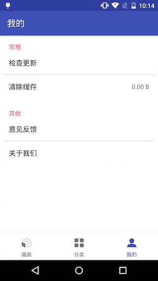

#秀秀漫画

主要功能：最新漫画、分类漫画、我的、观看记录、查找漫画；

主要技术点：三级缓存、RecyclerView的使用、design依赖包的使用、软件升级、清除缓存、意见反馈的实现、简单的用户使用统计(友盟实现)

###下载apk
[点击下载apk](http://bmob-cdn-491.b0.upaiyun.com/2016/08/10/a5d4e7dc401c52ae803068e9c1774760.apk)

###截图

###申明

该软件只能用于学习交流，内容版权均属于鼠绘漫画所有，如果侵权请联系本人，本人将及时删除。

